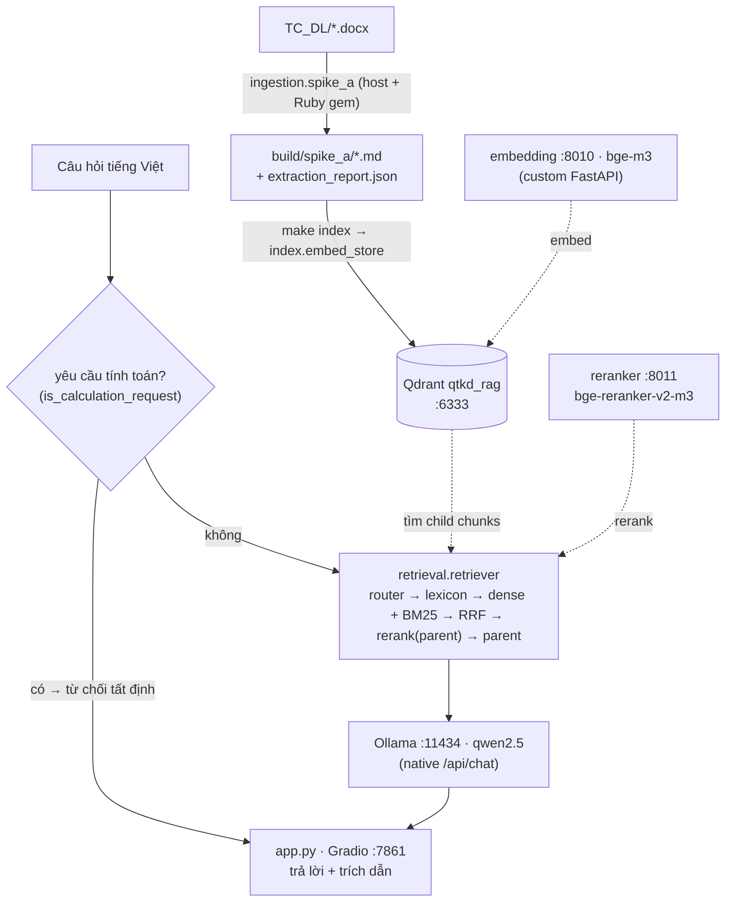
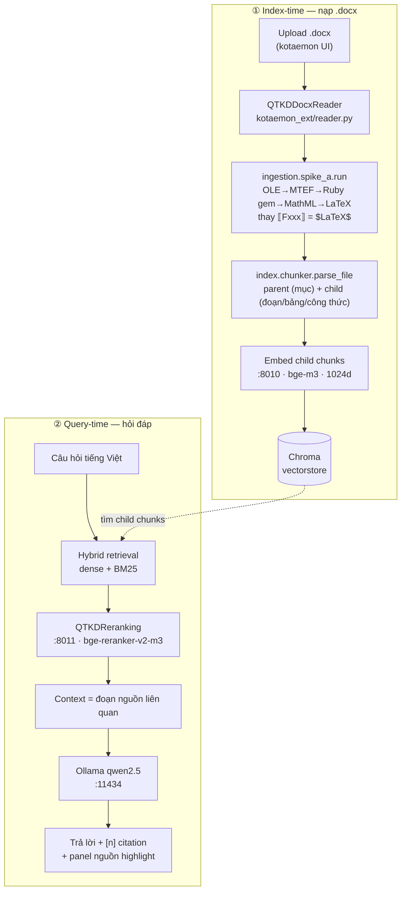

# RAG_TC_DL — Chatbot tra cứu tài liệu Đo lường (QTKĐ)

Hệ thống **RAG chạy hoàn toàn offline** để **tra cứu & trích dẫn** các Quy trình Kiểm định
(QTKĐ — *Quy trình Kiểm định*) của Cục Tiêu chuẩn–Đo lường–Chất lượng. Người dùng hỏi bằng
tiếng Việt → bot trả lời kèm **trích đoạn chính xác + công thức (LaTeX) + dẫn nguồn** (tên
file, mục/điều khoản). **Chỉ tra cứu — không tự tính toán.** Không gọi API cloud: mọi model
chạy local. Mục tiêu prod: 1 máy đơn **RTX 5060 8GB**, mở rộng từ vài file lên hàng nghìn QTKĐ.

> **Hai cách triển khai (ngang nhau):**
> - **Mode A — Docker (stack standalone):** một lệnh `make up` dựng `app.py` + Qdrant + dịch vụ
>   embedding/reranker + Ollama. Đây là đường đã được **đo chất lượng** (eval recall@5 = **1.000**,
>   55/55 — xem §5).
> - **Mode B — kotaemon (UI tương tác):** chạy giao diện kotaemon trên host với Chroma + adapter
>   `kotaemon_ext/`, phong phú cho quản lý tài liệu & chat.

**Mục lục**
1. [Tổng quan & vấn đề cốt lõi](#1-tổng-quan--vấn-đề-cốt-lõi)
2. [Công nghệ](#2-công-nghệ)
3. [Cài đặt chi tiết](#3-cài-đặt-chi-tiết)
4. [Workflow & luồng xử lý](#4-workflow--luồng-xử-lý)
5. [Kết quả Eval](#5-kết-quả-eval)
6. [Tham khảo](#6-tham-khảo)

---

## 1. Tổng quan & vấn đề cốt lõi

### Repo này là gì
Một chatbot hỏi–đáp trên kho tài liệu kỹ thuật đo lường. Người dùng gõ câu hỏi tiếng Việt
(ví dụ *"sai số cho phép của áp kế theo QTKĐ 1.061 là bao nhiêu?"*), hệ thống tìm đúng đoạn
trong tài liệu gốc, đưa cho LLM **chỉ những đoạn đó**, và trả về câu trả lời **kèm trích dẫn
nguồn** để người dùng tự đối chiếu. Toàn bộ chạy offline để dùng được trong môi trường nội bộ,
không phụ thuộc internet.

### Vấn đề cốt lõi: công thức KHÔNG phải text  *(Risk #1)*
Trong file `.docx` nguồn, công thức được nhúng dưới dạng **OLE object MathType (MTEF nhị
phân)** — `word/embeddings/oleObject*.bin` — kèm một ảnh WMF đã render. **Không có** công
thức dạng text (OMML / `m:oMath`). Trích text thông thường sẽ **mất sạch công thức**. Toàn
bộ tầng `ingestion/` tồn tại để **khôi phục công thức trung thực** thành `$LaTeX$`. Đây là rủi
ro lớn nhất của dự án — *độ chính xác công thức là mối quan tâm số 1 trong mọi thay đổi ingestion.*

```
.docx  →  OLE MathType (.bin, MTEF)  →  gem mathtype_to_mathml (Ruby)  →  MathML  →  LaTeX
                                                                                      ▲
                                          ⟦Fxxx⟧ placeholder trong Markdown được thay bằng $LaTeX$
```

---

## 2. Công nghệ

| Lớp | Thành phần | Ghi chú |
|---|---|---|
| **Giao diện** | **A:** `app.py` (Gradio 4.x, repo này) · **B:** [kotaemon](https://github.com/Cinnamon/kotaemon) (Apache-2.0) | Cả hai chạy `:7861` |
| **LLM sinh đáp án** | [Ollama](https://ollama.com) + **Qwen2.5** | `qwen2.5:1.5b` (dev) / `qwen2.5:7b` (prod), `:11434`; `generation.py` gọi **native `/api/chat`** (xem ghi chú §3.3) |
| **Embedding** | **bge-m3** (1024 chiều) qua **inference server tự viết** | `docker/inference/server.py` (FastAPI + sentence-transformers), `:8010`, `/v1/embeddings` |
| **Reranker** | **bge-reranker-v2-m3** qua cùng server (CrossEncoder) | `:8011`, `/v1/rerank` (Cohere-style); env `RERANKER_MAX_LENGTH` (mặc định 1024) |
| **Vector store** | **A: Qdrant** `:6333` (collection `qtkd_rag`) · **B: Chroma** (nhúng) | `VECTOR_SIZE = 1024` |
| **Trích xuất công thức** | Python `lxml` + `olefile`; **Ruby gem `mathtype_to_mathml`**; XSLT `vendor/xsltml/mml2tex.xsl` | OLE MathType → LaTeX |
| **Hybrid retrieval** | **A:** `retrieval/` (router → lexicon → dense + BM25 → RRF k=60 → rerank trên parent → parent) · **B:** kotaemon built-in | |
| **Adapter (Mode B)** | `kotaemon_ext/` | `QTKDDocxReader` (reader), `QTKDReranking` (reranker) |

### Hai mode triển khai
Hai dịch vụ **embedding `:8010`** và **reranker `:8011`** (cùng **Ollama `:11434`**) dùng chung
cho cả hai mode; chỉ khác phần UI + vector store + tầng truy hồi.

| | **Mode A — Docker (standalone)** | **Mode B — kotaemon (host)** |
|---|---|---|
| Khởi chạy | `make up` (1 lệnh) | `.venv/bin/python app.py` (trong `../kotaemon`) |
| UI | `app.py` Gradio `:7861` | kotaemon Gradio `:7861` |
| Vector store | **Qdrant** `:6333` | **Chroma** (nhúng) |
| Truy hồi | `retrieval/`: router → lexicon → dense + BM25 → RRF → rerank (parent) → parent | kotaemon hybrid + `QTKDReranking` |
| Nạp tài liệu | `ingestion.spike_a` (host) → `build/spike_a/` → `indexer` | `QTKDDocxReader` chạy khi upload |
| Eval | **Có** — retrieval recall@5 = 1.000 + answer-quality (xem §5) | Không qua harness này |
| Điểm mạnh | Tái lập, 1 lệnh, đã đo chất lượng | UI quản lý file/chat phong phú |

> Repo này (`RAG_TC_DL`) cung cấp **ingestion / index / retrieval / eval** và adapter
> `kotaemon_ext/`; [kotaemon](https://github.com/Cinnamon/kotaemon) (`../kotaemon`) là repo anh
> em, clone riêng (không phải submodule), chỉ dùng cho Mode B.

---

## 3. Cài đặt chi tiết

### 3.1 Yêu cầu trước
| Thành phần | Phiên bản | Dùng cho |
|---|---|---|
| Docker + Docker Compose | bất kỳ | **Mode A** (toàn bộ stack) |
| Python | 3.x + `.venv` (ingestion) · 3.10 cho kotaemon (Mode B, qua `uv`) | |
| Ruby | **2.6** + gem `mathtype_to_mathml` | Bóc công thức MathType (ingestion — cả 2 mode) |
| Ollama | ≥ 0.24 (nếu chạy native, ví dụ macOS) | Chạy LLM Qwen2.5 |

### 3.2 Ingestion — bóc công thức, tạo `build/spike_a/` *(chung cho cả 2 mode)*
Tầng ingestion **chạy trên host** (không nằm trong app container) và là bước **bắt buộc trước**
khi index ở Mode A.
```bash
cd /Users/mac/Desktop/AI4TA/RAG_TC_DL
python3 -m venv .venv && source .venv/bin/activate
pip install -r requirements.txt          # olefile, lxml, scikit-image, rank-bm25
gem install mathtype_to_mathml           # cần Ruby 2.6 (macOS system Ruby)

python -m ingestion.spike_a              # đọc TC_DL/ → ghi build/spike_a/*.md + extraction_report.json
```
> `ingestion/mtef_to_latex.py` hardcode `_GEM_PATHS` cho Ruby 2.6 macOS. Ruby khác chỗ → chỉnh
> `_GEM_PATHS` hoặc đặt biến `GEM_PATH`. Kiểm tra `build/spike_a/extraction_report.json` để xác
> nhận tỉ lệ chuyển công thức.

### 3.3 Mode A — Triển khai bằng Docker  *(stack standalone)*
Toàn bộ stack gói trong `docker-compose.yml` + điều khiển qua `Makefile`. **Trình tự:**
```bash
# 0) Đã chạy ingestion (§3.2) → có build/spike_a/   (compose mount thư mục này read-only)
make up            # build images + start: qdrant, embedding, reranker, ollama, app  (~10–20' lần đầu: tải model)
make pull-model    # tải qwen2.5:1.5b vào container ollama (~940MB); prod: make pull-model-7b
make index         # indexer: index.embed_store --force → nhúng build/spike_a/ vào Qdrant
# → mở http://localhost:7861
```

**Các service (`docker-compose.yml`):**
| Service | Image / build | Port | Ghi chú |
|---|---|---|---|
| `qdrant` | `qdrant/qdrant:v1.10.1` | 6333 | Vector DB, volume `qdrant_storage` |
| `embedding` | build `docker/inference` (`MODE=embedding`, `BAAI/bge-m3`) | 8010 | `/v1/embeddings`, 1024-dim |
| `reranker` | build `docker/inference` (`MODE=reranker`, `BAAI/bge-reranker-v2-m3`) | 8011 | `/v1/rerank` (Cohere-style) |
| `ollama` | `ollama/ollama:latest` | 11434 | LLM, volume `ollama_data` |
| `app` | build `.` → `python app.py` | 7861 | Gradio UI; mount `build/spike_a` + `TC_DL` (ro); đọc env `EMBED_URL/RERANK_URL/QDRANT_URL/OLLAMA_URL/OLLAMA_MODEL` |
| `indexer` | build `.` (profile `tools`) | — | Chạy 1 lần: `index.embed_store --force` |

**Inference server tự viết** — `docker/inference/server.py`: FastAPI + `sentence-transformers`
(`SentenceTransformer` cho embedding, `CrossEncoder` cho reranker). Model được **tải sẵn vào
image lúc build** (qua ARG `MODE` / `EMBEDDING_MODEL` / `RERANKER_MODEL`). Đây **không phải**
HuggingFace TEI; nó cài đúng định dạng `/v1/embeddings` + `/v1/rerank` mà code dự án cần (nên
không có vấn đề tương thích).

**Lệnh `make` thường dùng:**
| Lệnh | Tác dụng |
|---|---|
| `make up` / `make start` | Start (có / không rebuild) |
| `make down` | Dừng toàn bộ |
| `make logs` / `make status` | Xem log realtime / trạng thái container |
| `make pull-model` / `make pull-model-7b` | Tải `qwen2.5:1.5b` / `qwen2.5:7b` |
| `make index` | Index `build/spike_a/` vào Qdrant |
| `make rebuild` | Build lại images `--no-cache` rồi up |
| `make clean-volumes` | ⚠ Xoá toàn bộ data (Qdrant + Ollama models) |
| `make eval` | Chạy eval retrieval (trên host, dùng `kotaemon/.venv` — xem §5) |
| `make test-embed` / `make test-qdrant` | Smoke-test service `:8010` / collection Qdrant |

**Cấu hình `.env`** (sao chép từ `.env.example`): `OLLAMA_MODEL=qwen2.5:1.5b` (prod đổi `qwen2.5:7b`).

**GPU / nền tảng:**
- **macOS:** Docker không dùng được GPU Apple Silicon. Nên chạy **Ollama native** (`brew install
  ollama` + `ollama serve`), comment service `ollama` trong compose và đặt
  `OLLAMA_URL=http://host.docker.internal:11434/v1/chat/completions`.
  > Đặt env dạng `/v1/...` cho tương thích; `generation.py` **tự map sang native `/api/chat`**
  > lúc gọi — vì endpoint OpenAI-compat `/v1` của Ollama **bỏ qua trường `options`** (num_ctx /
  > num_predict không có hiệu lực, prompt dài bị cắt từ đầu — đo 2026-06-11). Có unit-test ghim.
- **Linux + RTX 5060 (Blackwell, sm_120):** cần **`nvidia-container-toolkit`**, bỏ comment khối
  `deploy.resources` của service `ollama`, và driver/toolkit **CUDA 12.8+**. Embedding & reranker
  chạy **CPU** là đủ (theo `docs/PLAN.md`), giữ VRAM cho LLM.
- **Volumes bền:** `qdrant_storage`, `ollama_data` (giữ qua restart; `make clean-volumes` để xoá).

### 3.4 Mode B — kotaemon (UI tương tác trên host)
Giao diện kotaemon với Chroma + adapter `kotaemon_ext/`. Dùng chung service `:8010/:8011/:11434`
với Mode A (cần các container đó chạy, hoặc tự dựng).
```bash
cd /Users/mac/Desktop/AI4TA
git clone https://github.com/Cinnamon/kotaemon.git      # repo anh em (cạnh RAG_TC_DL)
cd kotaemon
uv python install 3.10 && uv sync --python 3.10         # tạo .venv + deps (gradio, chromadb, lancedb…)
```
Tuỳ biến trong **`../kotaemon/flowsettings.py`**:
```python
sys.path.insert(0, str(Path(__file__).parent.parent / "RAG_TC_DL"))   # import ingestion/index/kotaemon_ext
KH_VECTORSTORE = {"__type__": "kotaemon.storages.ChromaVectorStore", "path": ...}   # Chroma
KH_EMBEDDINGS["bge-local"] = {"spec": {..., "base_url": "http://localhost:8010/v1",
                                       "model": "bge-large-en-v1.5"}, "default": True}   # gọi service :8010 (thực tế phục vụ bge-m3)
KH_RERANKINGS["qtkd"] = {"spec": {"__type__": "kotaemon_ext.reranker.QTKDReranking",
                                  "endpoint_url": "http://localhost:8011/v1/rerank"}, "default": True}
FILE_INDEX_PIPELINE_FILE_EXTRACTORS = {".docx": "kotaemon_ext.reader.QTKDDocxReader"}
FILE_INDEX_PIPELINE_SPLITTER_CHUNK_SIZE = 8192          # tránh double-chunking làm vỡ công thức
KH_INDICES = [{"name": "File Collection", "config": {"supported_file_types": ".docx"}, ...}]
```
> Chuỗi `"model": "bge-large-en-v1.5"` chỉ là nhãn gửi kèm request; inference server bỏ qua và
> dùng đúng model đã nạp (**bge-m3**). Cả 2 mode vì vậy đều nhúng bằng bge-m3, 1024 chiều.

`../kotaemon/.env`: `KH_FEATURE_USER_MANAGEMENT=false`, `KH_ENABLE_FIRST_SETUP=false` (tắt login),
`LOCAL_MODEL=qwen2.5:1.5b`, `KH_OLLAMA_URL=http://localhost:11434/v1/`, `OPENAI_API_KEY=` (trống).

**Patch LaTeX inline (bắt buộc)** — Gradio mặc định chỉ render `$$...$$`; thêm delimiter `$...$`
vào `kotaemon/libs/ktem/ktem/pages/chat/chat_panel.py` (chi tiết
[`docs/spike_c_ui_setup.md`](docs/spike_c_ui_setup.md) §6).

**Chạy:**
```bash
cd /Users/mac/Desktop/AI4TA/kotaemon
GRADIO_SERVER_PORT=7861 .venv/bin/python app.py     # → http://localhost:7861
```
> Cả hai mode đều dùng `:7861` → chạy **lần lượt** hoặc đổi port.

### 3.5 Cơ sở dữ liệu & lưu trữ
| Mode | Vị trí | Loại | Nội dung |
|---|---|---|---|
| A | Qdrant volume `qdrant_storage` | **Qdrant** | Collection `qtkd_rag` (cosine, 1024) |
| B | `kotaemon/ktem_app_data/user_data/vectorstore/` | **Chroma** | Vector child chunks |
| B | `kotaemon/ktem_app_data/user_data/docstore/` | **LanceDB** | Văn bản gốc chunks |
| B | `kotaemon/ktem_app_data/user_data/sql.db` | **SQLite** | Mặc định model, danh sách file, hội thoại |

> Mode B: `.env` **chỉ đọc lần đầu**; muốn reset → xoá `ktem_app_data/`. Mode A: `make clean-volumes`.

---

## 4. Workflow & luồng xử lý

Cả hai mode dùng chung tầng **ingestion** (bóc công thức) và 3 dịch vụ (embedding `:8010`,
reranker `:8011`, Ollama `:11434`); khác nhau ở vector store + tầng truy hồi.

### Mode A — Docker (standalone, `app.py` + Qdrant)


### Mode B — kotaemon (UI tương tác, Chroma)
Hai thời điểm: **nạp tài liệu** (index-time) và **hỏi đáp** (query-time).


**Luồng logic & ranh giới trách nhiệm:**
- **Ingestion** (`spike_a` → `chunker`) bóc công thức MathType → `$LaTeX$` và chia parent/child.
  Mode A chạy batch trên host (`make index`); Mode B chạy trong bộ nhớ mỗi lần upload qua
  `QTKDDocxReader`. `CHUNK_SIZE=8192` (Mode B) ngăn kotaemon cắt lại child chunk làm **vỡ công
  thức inline**.
- **Truy hồi** lấy child chunk liên quan → rerank cross-encoder (`:8011`) → ghép context → Ollama
  sinh đáp án **chỉ dựa trên context**, tiếng Việt, **không tính lại công thức**, kèm trích dẫn.
- **Lookup-only được cưỡng chế TẤT ĐỊNH** (Mode A): câu yêu cầu tính toán có số liệu cho sẵn bị
  từ chối **trước khi** retrieve (`is_calculation_request`); mọi nội dung model viết thêm sau câu
  từ chối chuẩn bị cắt (`enforce_refusal_stop`) — không trông vào model tự tuân prompt.
- **Độ trung thực công thức thuộc về `ingestion/`** — không phụ thuộc framework truy hồi.

### Kho tài liệu & trạng thái
`TC_DL/` có **11 file**: 7 `.docx` (đã xử lý) + 3 `.doc` + 1 `.xls` (**legacy — báo cáo nhưng
bỏ qua**, cần LibreOffice chuyển `.docx` trước = "Spike B", chưa làm).

---

## 5. Kết quả Eval

`eval/run_eval.py` đo chất lượng **tầng truy hồi standalone** (`retrieval/retriever.py` + Qdrant —
tức Mode A) trên bộ **55 câu hỏi** `eval/eval_set.jsonl` (mỗi câu gắn `file_stem` + `section_path`
kỳ vọng). Một câu tính là *hit* nếu kết quả khớp đúng file và đúng mục (hoặc mục con). Metrics:
**recall@{1,3,5,10}, nDCG@k, MRR**. Tiêu chí đạt: **recall@5 ≥ 0.85**.
*(Mode B kotaemon có tầng truy hồi riêng, không nằm trong harness này.)*

### Kết quả hiện tại — 2026-06-11 (đợt R1–R6), hybrid
| Metric | 2026-06-07 | **2026-06-11** |
|---|---|---|
| **recall@5** | 0.909 (50/55) | **1.000 (55/55)** ✅ |
| recall@10 | 0.982 | **1.000** |
| recall@1 | 0.655 | **0.782** |
| nDCG@5 | 0.799 | **0.908** |
| MRR | 0.771 | **0.876** |
| Bộ gold mở rộng (10 câu chưa từng tune) | — | recall@5 = 1.000, MRR 0.925 |

**recall@5 theo từng tài liệu: 7/7 file = 1.00** (QTKD_1.063 từ 0.67 → 1.00).

**Tiến trình:** 0.709 → 0.909 (Phase 1–3, 2026-06-07: parent-rerank, lexicon, sửa heading) →
**1.000** (R1–R6, 2026-06-11):
- **R1** — chặn boilerplate "Phụ lục A/B" trần (form MẪU BIÊN BẢN nằm trong body heading
  trần ở 1.061/62/63 → honeypot cho cross-encoder; predicate `is_noise_path` dùng chung).
- **R2** — lexicon "điều kiện kiểm định" → từ vựng body (cầu tiêu-đề→nội-dung).
- **R3** — document rerank = breadcrumb `file — mục` + cửa sổ 1400 ký tự neo theo child
  (server reranker cắt 512 token → mục dài bị chấm mù phần chứa đáp án).
- **R4/R6** — router gom MỌI tín hiệu file; câu so sánh ≥2 thiết bị chạy phễu RIÊNG
  từng file + quota đại diện trong top-5 (trước đây bị ghim 1 file → nửa kia không bao
  giờ được retrieve).
- **R5** — guard heading mở rộng (câu kết thúc `.`/caption Hình/Bảng) → re-extract +
  re-index 1.071 (guardrail 351 span $LaTeX$ byte-identical).

> Chất lượng CÂU TRẢ LỜI (qwen2.5:7b, 29 câu khó, cùng backend + cùng scorer):
> coverage 0.725→**0.877**, citation_strict 0.806→**0.857**, ảo giác 0.069→**0.034**,
> từ chối oan 4→**1** — chi tiết tại [`result_eval.md`](result_eval.md).
> Lưu ý hạ tầng: endpoint OpenAI-compat `/v1` của Ollama **bỏ qua `options`** →
> `generation.py` nay gọi native `/api/chat` (num_ctx/num_predict có hiệu lực thật).

### Chạy lại eval

**Retrieval** (recall@k + nDCG + MRR — cần `:8010`/`:8011`/`:6333` + `kotaemon/.venv`):
```bash
make eval                                          # = run_eval --mode hybrid (55 câu)
python -m eval.run_eval --mode both -v             # so sánh hybrid vs dense, in section_path mỗi hit
python -m eval.run_eval --debug-miss               # mỗi câu trượt: rank từng tầng (dense/bm25/fused/rerank)
python -m eval.run_eval --eval-file eval/eval_set_ext.jsonl   # bộ gold MỞ RỘNG 10 câu (chống overfit)
```

**Answer-quality** (coverage / citation / refusal / ảo giác — cần thêm Ollama `:11434` + model đã pull):
```bash
make answer-eval                                   # so 1.5b vs 7b (29 câu khó, eval/answer_set.jsonl)
make answer-eval-dev                               # chỉ 1.5b (nhanh)
python -m eval.answer_eval --model qwen2.5:7b -v --dump /tmp/rec_{model}.jsonl   # chấm prod + dump từng câu
```
> ⚠ Số answer-quality chỉ đáng tin trên **qwen2.5:7b** (1.5b không ghi `[n]` — model-bound) và
> trên backend ổn định (GPU prod, hoặc Ollama native; 7b trong Docker-VM hay bị OOM-kill → 500).

Yêu cầu: service `:8010`/`:8011`/`:6333` (+ `:11434` cho answer-eval) đang chạy + `kotaemon/.venv`
trên host. `make check` (115+ unit test + guard công thức 351/351) là cổng CI không cần Docker.
Lịch sử số liệu lưu ở [`result_eval.md`](result_eval.md).

---

## 6. Tham khảo

**Framework & mô hình**
- [kotaemon](https://github.com/Cinnamon/kotaemon) — RAG UI framework (Cinnamon, Apache-2.0, Gradio 4.x)
- [Ollama](https://ollama.com) — runtime LLM local · [Qwen2.5](https://github.com/QwenLM/Qwen2.5) (Alibaba) — LLM sinh đáp án
- [BGE — FlagEmbedding](https://github.com/FlagOpen/FlagEmbedding) (BAAI) — `bge-m3` (embedding, 1024d) + `bge-reranker-v2-m3` (reranker)

**Hạ tầng truy hồi & phục vụ**
- [sentence-transformers](https://www.sbert.net/) + [FastAPI](https://fastapi.tiangolo.com/) — inference server tự viết (`docker/inference/`)
- [Qdrant](https://github.com/qdrant/qdrant) — vector DB (Mode A, collection `qtkd_rag`) · [Chroma](https://github.com/chroma-core/chroma) — vector store nhúng (Mode B)
- [rank-bm25](https://github.com/dorianbrown/rank_bm25) — BM25 in-memory · RRF (k=60, Cormack et al. 2009)
- [Docker Compose](https://docs.docker.com/compose/) — điều phối stack (Mode A)

**Trích xuất công thức**
- [mathtype_to_mathml](https://rubygems.org/gems/mathtype_to_mathml) — Ruby gem: MathType MTEF → MathML
- [xsltml (`mml2tex.xsl`)](https://sourceforge.net/projects/xsltml/) — XSLT MathML → LaTeX (vendored `vendor/xsltml/`)
- [lxml](https://lxml.de/) — đọc `word/document.xml` · [olefile](https://github.com/decalage2/olefile) — đọc OLE `.bin` · [scikit-image](https://scikit-image.org/) — SSIM so ảnh công thức
- [Gradio](https://www.gradio.app/) + [KaTeX](https://katex.org/) — UI web + render công thức

**Tài liệu nội bộ**
- [`docs/PLAN.md`](docs/PLAN.md) — thiết kế & kế hoạch đầy đủ · [`docs/spike_c_ui_setup.md`](docs/spike_c_ui_setup.md) — bake-off UI + setup
- [`docs/plan-7.md`](docs/plan-7.md) — kế hoạch cải thiện retrieval · [`result_eval.md`](result_eval.md) — log kết quả eval · [`CLAUDE.md`](CLAUDE.md) — hướng dẫn kiến trúc cho agent
