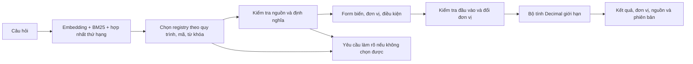

# Review bản chất phương pháp

## Kết luận

Đây là **RAG kết hợp thư viện bộ tính đã đối chiếu**. Phần tìm kiếm hỗ trợ tìm đúng nguồn; phần tính toán là chương trình xác định từ trước. Hiện chưa phải hệ thống tự đọc tài liệu bất kỳ và tự xây bộ tính đáng tin cậy.

## Hai giai đoạn

### Chuẩn bị trước khi có câu hỏi

1. Trích DOCX: văn bản, bảng, công thức Word Math (OMML), hoặc đối tượng MathType/OLE kèm ảnh hiển thị.
2. Đối chiếu thủ công với nguồn: biểu thức, ký hiệu, biến, đơn vị, số loạt đo và điều kiện. Artifact mất mẫu số/vế phải không được tự sửa theo công thức quen thuộc.
3. Viết định nghĩa thực thi vào catalog: ví dụ `rho*g*h`, biến `rho/g/h`, các đơn vị và miền dữ liệu; viết riêng điều kiện nghiệp vụ.
4. Pin hash DOCX, fingerprint card/định nghĩa (v3 thêm nội dung điều kiện), xây ca tính đối chứng rồi kiểm thử.

Đây là nơi phát sinh phần lớn công sức khi mở rộng. Hiện việc đối chiếu do trợ lý thực hiện ở mức kỹ thuật; chưa thay thế phê duyệt chuyên gia.

### Khi người dùng hỏi

Embedding biểu diễn câu hỏi và đoạn tài liệu; BM25 tìm từ khóa; RRF hợp nhất thứ hạng. Bộ chọn công thức vẫn chủ yếu là luật từ khóa/alias, schema biến và mã quy trình. Các card mới phải xuất hiện trong kết quả truy hồi thì mới được mở form.

Chat LLM không sinh biểu thức chạy hoặc đáp án trong nhánh registry. Backend duyệt cây cú pháp với tập phép toán/hàm cho phép, không chạy `eval` hay mã Python do mô hình tạo. Nếu hỏi một công thức có trong DOCX nhưng chưa có định nghĩa, lab thường yêu cầu làm rõ/chặn; chưa có phân loại đầy đủ để giải thích riêng từng lý do chưa hỗ trợ.

## RAG đóng góp gì, registry đóng góp gì?

| Thành phần | Có trách nhiệm | Không chứng minh được |
|---|---|---|
| Truy hồi | Tìm đoạn liên quan, đưa ngữ cảnh nguồn | Đoạn đó đúng chuyên môn hoặc đủ mọi điều kiện |
| Bộ chọn | Ghép yêu cầu vào định nghĩa đã có, phân biệt nguồn | Hiểu mọi cách diễn đạt hay hội thoại nhiều lượt |
| Registry | Cố định biểu thức, biến và điều kiện có thể kiểm tra | Tự hiểu công thức mới từ tài liệu mới |
| Hash | Phát hiện phiên bản/định nghĩa bị thay đổi | Công thức gốc đúng về vật lý hoặc được chuyên gia phê duyệt |
| Bộ tính | Thực hiện số học và đổi đơn vị trong miền cho phép | Số liệu người dùng phản ánh đúng phép đo thực tế |
| Checkbox | Yêu cầu người dùng xác nhận điều kiện | Điều kiện đó đã thật sự được đáp ứng |

## Ý nghĩa của việc mở rộng bảy tài liệu

Catalog hiện có 47 bộ tính, trong đó 6 là quy tắc định lượng từ lời văn. Mỗi nguồn trong bảy DOCX có ít nhất một bộ tính. Độ phủ theo danh mục phương trình hiện có là 43/174 lần xuất hiện, khoảng 24,7%; 131 lần chưa có bộ tính đối chiếu.

Các dạng đại số có thể lặp lại giữa hai quy trình nhưng vẫn cần định nghĩa nguồn riêng. Vì vậy số bộ tính không bằng số họ toán học độc lập. Một bộ tính cũng có thể ghép nhiều phương trình. Riêng 1.159 mới hỗ trợ 1/67 lần xuất hiện; 1.062 không có phương trình nhúng trong danh mục, ba bộ tính của nó lấy từ lời văn.

## Cách đánh giá kết quả hiện tại

427 ca pytest đạt xác nhận những hành vi đã được viết thành kiểm tra. 42 ca số HTTP và 21 ca trình duyệt mới chạy trên dữ liệu phát triển công khai; không phải bằng chứng đánh giá mù hay độ chính xác tổng quát 100%. Mỗi câu hỏi mới chỉ có một bộ số neo và một bản đổi đơn vị tương đương. Chưa có đánh giá độc lập cho câu hỏi tự nhiên do người khác soạn.

Khả năng từ chối giúp giảm việc trả sai, nhưng từ chối nhiều có thể làm hệ thống ít hữu ích. Cần báo riêng: độ phủ, chọn đúng công thức, trả đúng số, từ chối nhầm, sai vẫn trả ra và lỗi hạ tầng. Không cộng từ chối đúng vào tỷ lệ trả lời được.

## Định hướng phù hợp

Nếu mục tiêu là bộ tính nghiệp vụ trên một tập quy trình xác định, registry là nền tảng có thể kiểm tra và quản lý phiên bản. Nút thắt nằm ở tốc độ đối chiếu và duyệt công thức, không nằm ở tốc độ số học.

Nếu mục tiêu nghiên cứu là tự xử lý DOCX mới, cần bổ sung một bước đề xuất định nghĩa tự động từ biểu thức và ngữ cảnh, rồi kiểm tra cấu trúc, đơn vị, điều kiện và ca đối chứng trước khi đưa vào registry. Khi đó phải đánh giá riêng tốc độ/công sức xây registry, chất lượng đề xuất và khả năng trên công thức/tài liệu chưa thấy. Demo hiện tại chưa chứng minh bước tự động này.

Hướng hợp lý là tự động hoá việc chuẩn bị bản nháp để giảm công sức đối chiếu, đồng thời giữ lớp thực thi có kiểm soát. Lần mở rộng hiện tại hoàn thành phần bổ sung thủ công và kiểm chứng, chưa triển khai cơ chế tự đề xuất đó.
